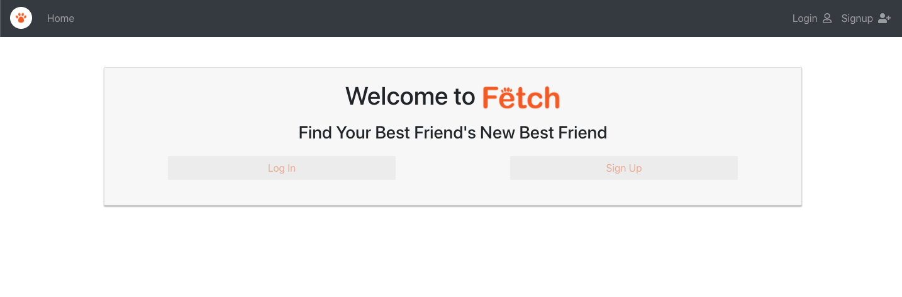
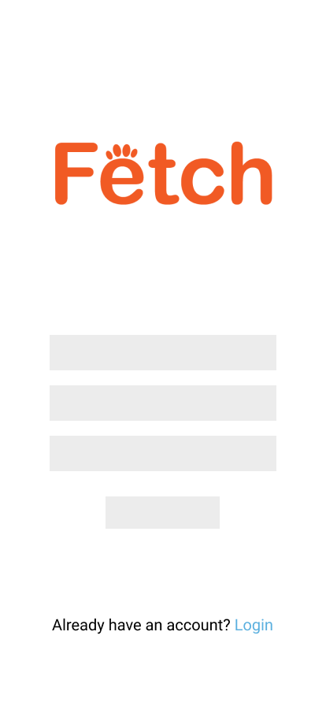
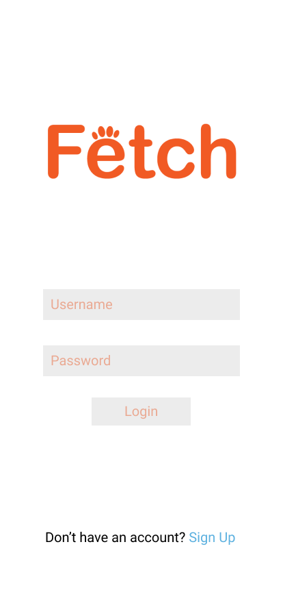
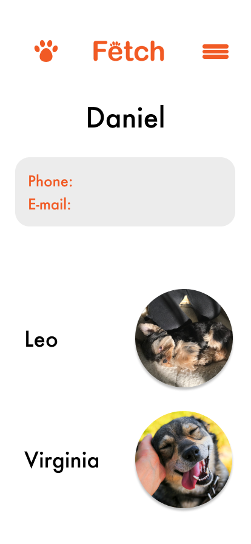
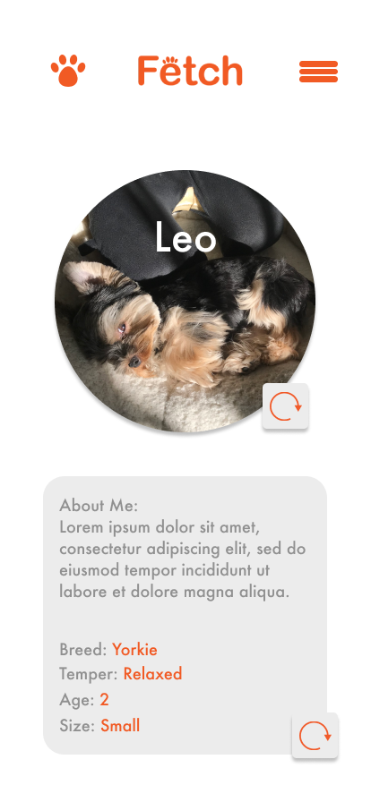
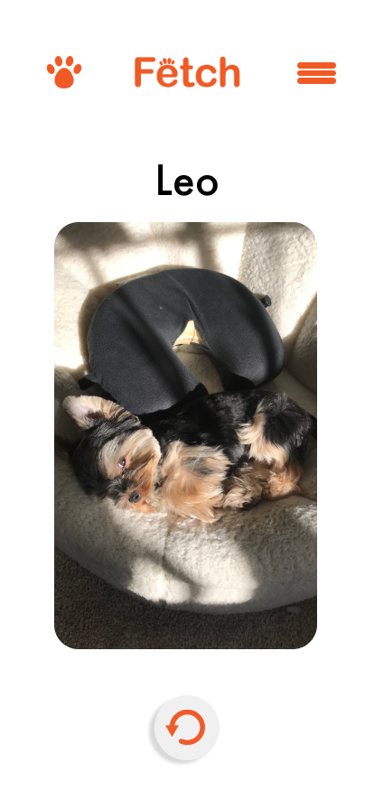
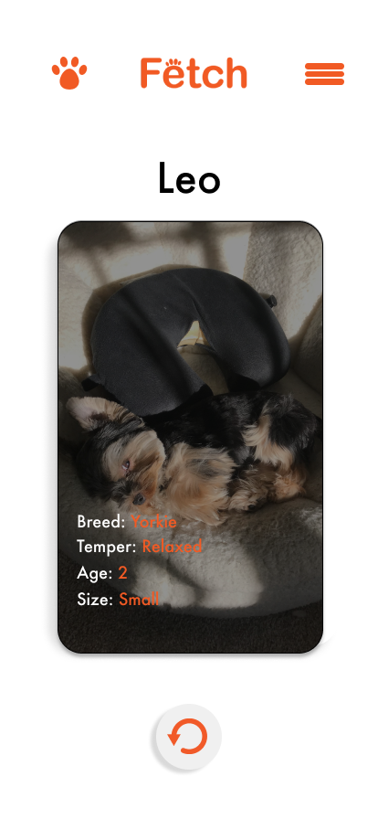
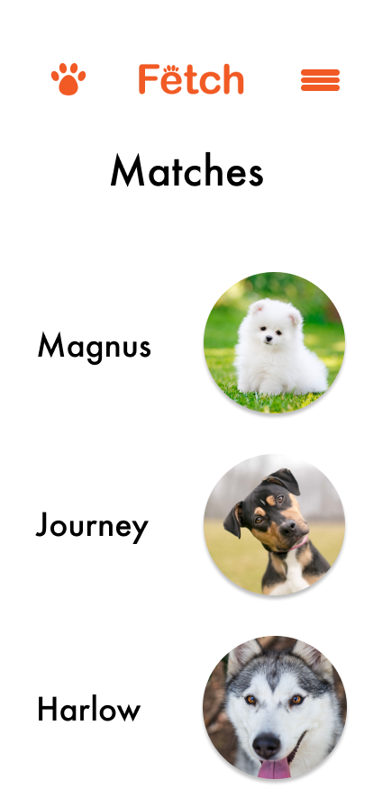

# Team-2-Project
## Fetch (frontend)

[**Link to Backend Repo**](https://github.com/SFX818/Team-2-backend)

[**Link to Deployed App**](http://fetchappforpals.surge.sh/)

---

### User Stories

* As a user, I want to sign up and create a personal acount
* As a user, I want to select and set my location for the app
* As a user, I want to add as many dogs to my profile as I want
* As a user, I want to be able to update and/or delete my user profile
* As a user, I want to be able to update and/or delete my dog profiles
* As a user, I want to set my preferences for dogs served to me by the app
* As a user, I want to swipe right to accept and swipe left to reject dogs served to me by the app
* As a user, I want to see a list of accepted dogs that match my dog

---

### Technology Used

* React
* React Router
* Bootstrap
* Axios
* [Cloudinary API](https://cloudinary.com/)
* [react-tinder-card](https://github.com/3DJakob/react-tinder-card#readme)

---

### Installation Instructions
1. npm i
2. npm start

---

### Landing Page

---

### Wireframes

---

---

---

---

---

---

---

- general approach (a couple paragraphs)
- installation instructions
- unsolved problems / major hurdles
